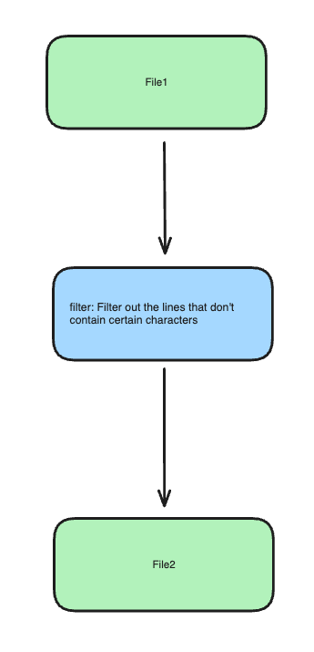
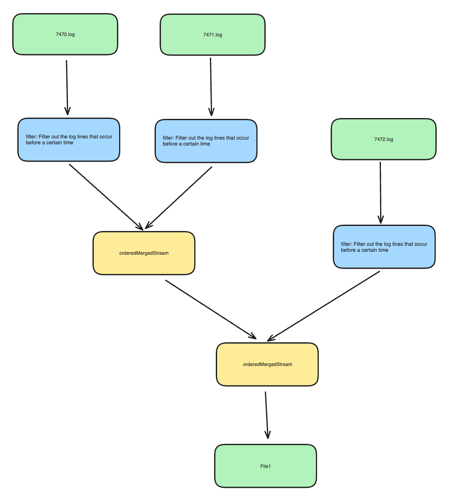

# Log File Analyser

Tool to help you filter for interesting lines in your log file.

# Iterator Adapters (composable)

Apply a filter to a file's lines and write them to file.

Apply a filter, merge the lines across multiple files, and write the output to file.

# Examples

- `cargo run --example simple`
- `cargo run --example merge_and_print`